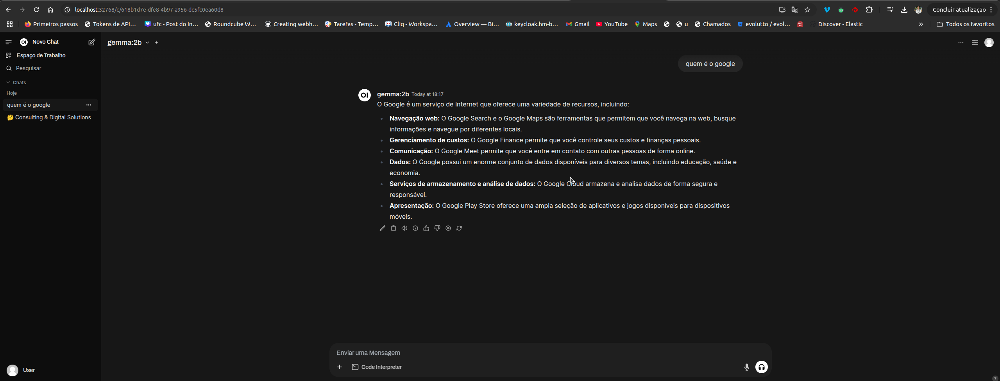

# Ollama & Open WebUI with Traefik

This repository provides a simple setup for running [Ollama](https://ollama.com/) and [Open WebUI](https://github.com/open-webui/open-webui) with [Traefik](https://traefik.io/) as a reverse proxy using **Docker Compose**. This setup automatically downloads the required models, so everything is set up with a single command.

## 💡 Recommended Hosting
This example is meant to run on a small **VPS (Virtual Private Server)** showing that you can run lightweight models on dual core + 8GB RAM systems.

I highly recommend using **Hostinger**, which offers excellent and affordable plans. Check them out with this link: [Hostinger Plans](https://ewbr.cc/hostinger-ew-1001)

## ⭐ Support This Project
If you find this project useful, please consider giving it a **star** on GitHub! ⭐ Your support helps keep this project maintained and encourages further development.

## 🚀 Quick Start

### Prerequisites
Ensure you have the following installed:
- [Docker](https://docs.docker.com/get-docker/)
- [Docker Compose](https://docs.docker.com/compose/install/)

### Installation
1. Clone this repository:
   ```sh
   https://github.com/isaelsilva1039/ai-ollama-docker.git
   cd sua-pasta-caso-aonde-repo-foi-clonado
   ```

2. Set up your domain by modifying the `.env` file:
   ```sh
   DOMAIN=srv665452.hstgr.cloud  # Change this to your actual domain
   ```

3. Run the installation script (to install Docker if not already installed):
   ```sh
   ./install-docker.sh
   ```

4. Start the services:
   ```sh
   docker-compose up -d
   ```

## 📜 Services Included

### 1. **Traefik (Reverse Proxy & SSL)**
- Handles HTTPS with Let's Encrypt.
- Routes traffic to **Ollama** and **Open WebUI**.
- Configured via `traefik.yml`.

### 2. **Ollama (LLM Inference Engine)**
- Hosts AI models.
- Auto-downloads predefined models (`gemma:2b`, `deepseek-r1:1.5b`, `qwen2.5-coder:1.5b`, `codegemma:2b`).
- Accessible via `https://your-domain/ollama`.

### 3. **Ollama Model Loader**
- A helper service that ensures models are downloaded inside the Ollama container before usage.

### 4. **Open WebUI (Frontend for Ollama)**
- Provides a web-based interface for interacting with AI models.
- Accessible via `https://your-domain/`.

## 🛠 Scripts

### `request-ollama.sh`
This Bash script allows users to get available model tags and send prompts to Ollama.
Usage:
```sh
./request-ollama.sh "Your prompt here"
```

### `upload.sh`
Uploads all files in the diretory to the VPS via SCP

## ⚠️ **Production Warning**
This repository is intended for **example purposes only** and is not recommended for production use.
For production deployments, consider using **Kubernetes**, **Docker Swarm**, or other orchestration tools to ensure high availability and security.

## 📜 Configuration
Modify the `.env` file to set your domain:
```sh
DOMAIN=srv665452.hstgr.cloud
```

## 📎 Additional Notes
- This setup automatically downloads AI models inside the Ollama container.
- Make sure to configure your DNS settings to point your domain to your server's IP.

## 📝 License
This project is licensed under the MIT License.



